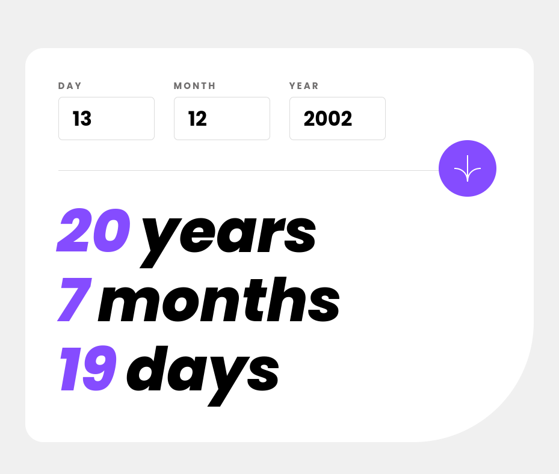

# Exercício 11 | age-calculator

## Aplicando tecnicas de Flexbox, grid, responsividade e javascript, alem de muito raciocínio para pensar em todas as posibilidades

Esse exercício já precisei dedicar um pouco mais mas foi uma experiência muito boa.

<a href="https://lucasramosfs.github.io/projeto11-age-calculator/ "> Clique aqui para acessar a página</a>

### Resultado final

